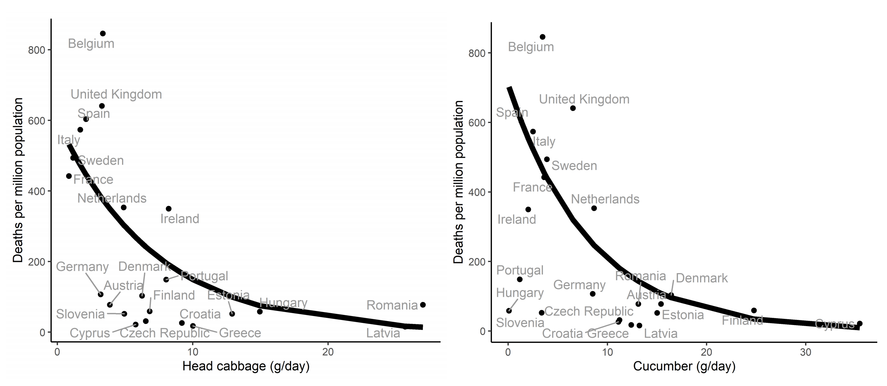

# covid19-viz

## The good

## The bad

- Source: https://twitter.com/fdhjr71/status/1261466653876879363?s=20

"On the official Georgia COVID stats web page is this graph. Looks good, getting better, right? Look closer at the dates on the X-axis. They have arranged the dates out of order to create a declining appearance."

{width="50%"}

See https://livefreeordichotomize.com/2020/05/17/graph-detective/ for improving this in R.

- Source: https://twitter.com/andishehnouraee/status/1284241173008330753

"In just 15 days the total number of #COVID19 cases in Georgia is up 49%, but you wouldn’t know it from looking at the state’s data visualization map of cases. The first map is July 2. The second is today. Do you see a 50% case increase? Can you spot how they’re hiding it?"

- Source: https://www.medrxiv.org/content/10.1101/2020.07.17.20155846v1.full.pdf

"After adjusting for potential confounders, for each g/day increase in consumption of head cabbage of the country, the mortality risk for COVID-19 decreases by 13.6 %. For each g/day increase in consumption of cucumber, the mortality risk decreases by 15.7%. Consumption of lettuce and broccoli showed the opposite pattern, i.e. a higher consumption was associated with a higher COVID-19 mortality. However, the results were more sensitive to adjustment, and the associations were no longer significant in some of the models."

H/t [@callin_bull](https://twitter.com/callin_bull/status/1285396233406709760?s=20)

- 
